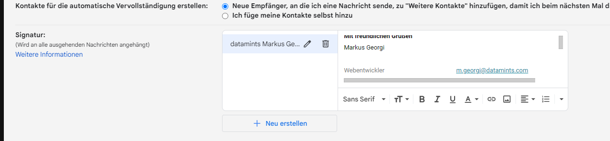

### Signatur in Google Gmail Web Oberfläche eintragen
?> Verwendet man Outlook oder einen anderen befähigten E-Mail Client ist dies nicht nötig. 

Wenn man bei da bei Google seine Signatur hinterlegen will, muss man seine im Browser geöffnete Signatur markieren, kopieren

und in das Feld einfügen

nicht den html Quellcode einfügen

Vorlage liegt unter:

[G:\daten\Marketing_datamints\KOMMUNIKATION\Email_Signatur\Google_Signatur](G:\daten\Marketing_datamints\KOMMUNIKATION\Email_Signatur\Google_Signatur)

**Danke Markus!**
