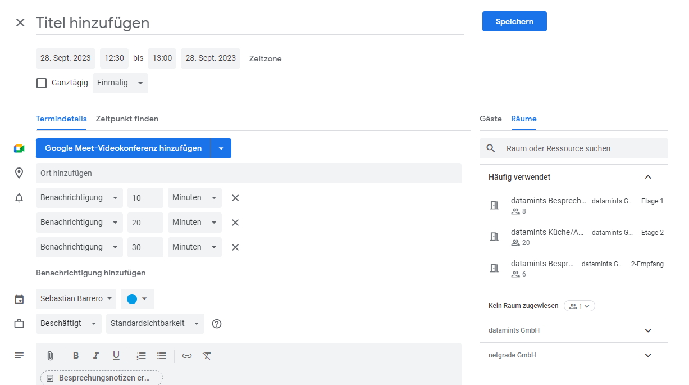
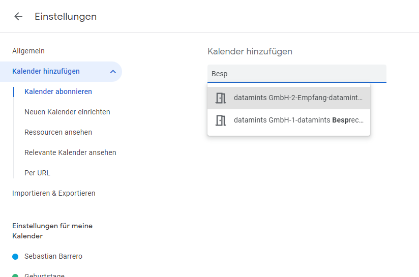

## Besprechungsraum Termin einstellen und Raum wählen
- Google Kalender -> eintragen -> Termin -> Räume oder Ort hinzufügen -> Raum wählen
- Beispielscreenshot

## Kalender eines Besprechungsraumes abbonieren
