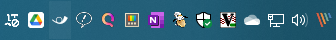
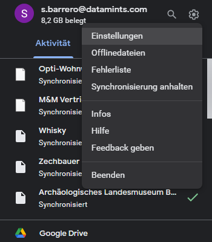
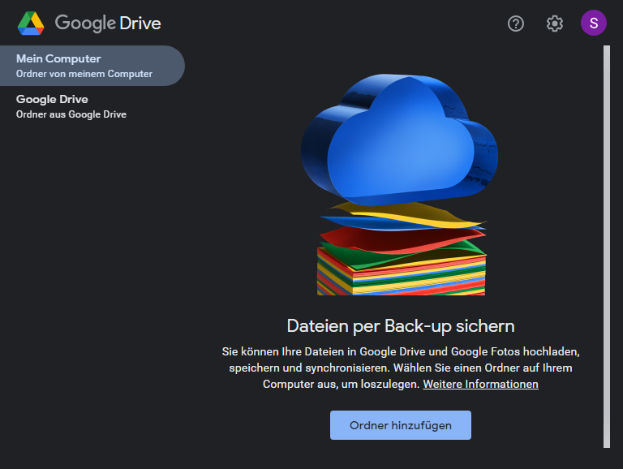
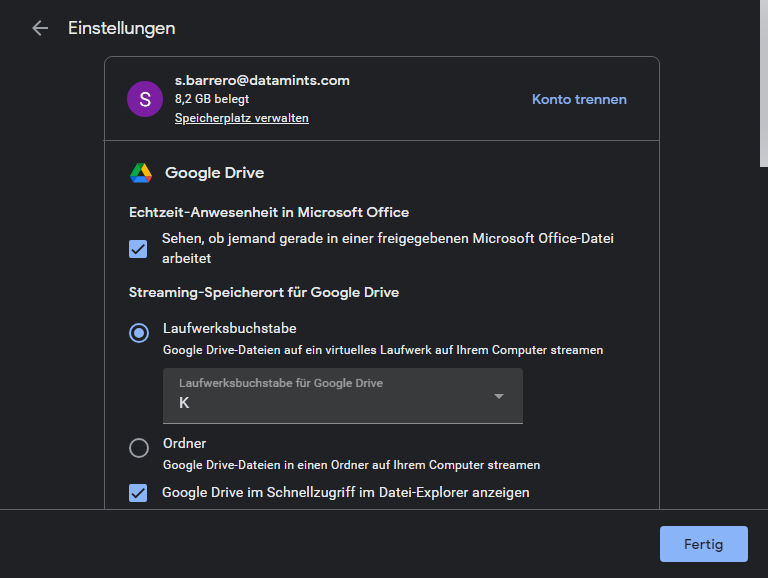

## Google Drive Desktop installieren
download: https://www.google.com/drive/download/
ca. 300 MB

### Einstellungen und Laufwerksbuchstabe
?> Bitte wie in den Screenshots einstellen

Screenshot 1: Ist Gdrive installiert erscheint es in der Taskleiste. Dort auf das Icon klicken und man kommt zum nächsten Screenshot

Screenshot 2: Zahnrad Icon klicken und dann "Einstellungen" wählen

Screenshot 3: Wieder Zahnrad oben rechts klicken

Screenshot 4: Laufwerkbuchstabe und Buchstabe K wählen. Alle anderen Einstellungen sind eher unwichtig

!> Der Laufwerksbuchstabe ist wichtig, damit wir Links auch so angeben können.

## Google Drive unter Linux (Gnome) einbinden.
- In Einstellungen > Online-Konten > Google mit dem Google Konto anmelden.
- Dann hat man Drive automatisch im Dateibrowser (nautilus) gemapped
- - Danke Michael

### Gibt es "Für mich freigegeben" im Windows Explorer?
Nein, die Option "Für mich freigegeben" ist nicht direkt im Windows Explorer verfügbar. 

### Hinweis Ordner Farben
- Benutzerdefinierte Ordnerfarben in Meine Ablage, geteilten Ablagen und Verknüpfungen sind **nur für dich sichtbar**. 

