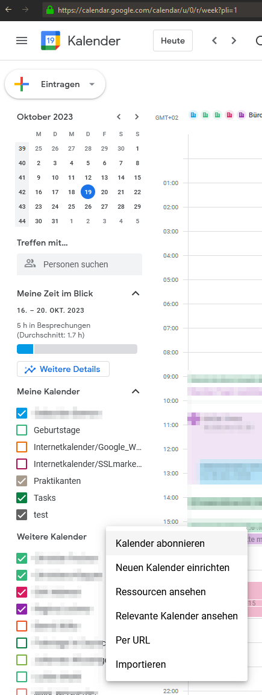
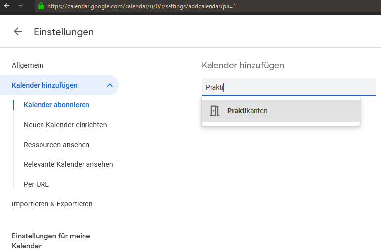
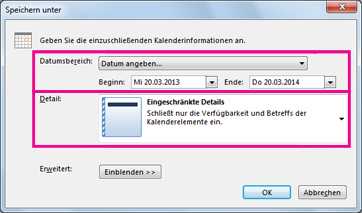

## Kalender (z.B. von Kollegen) einsehen / abonnieren
Hinweis: Das ist nicht "importieren". Das wollen wir in dem Fall ja auch nicht. 
- calender.google.com
- links auf "Weitere Kalender"
- Plus Zeichen
- Kalender Abonnieren
- Name wählen
- Fertig

Hinweis: Es müssen vom Admin oder Inhaber des Kalenders Rechte gesetzt sein. Einstellungen und Freigabe bei den drei Punkte am Kalender wählen, dann Für bestimmte Personen oder Gruppen freigeben. Vollzugriff ist "Änderungen vornehmen und Freigaben verwalten".

## Google Kalender in Outlook einrichten

### Exportieren eines Kalenders aus Outlook nach Google Calendar
#### Exportieren Ihres Kalenders aus Outlook
1. Kalender in Outlook öffnen und den zu exportierenden Kalender auswählen
2. Datei >  Kalender speichern (linker Rand), dann...

!> Wichtig: Im folgenden Dialogfeld die weiteren Optionen beachten -> Zeitraum und Vollständigkeit angeben und unter "Einblenden >>>" bitte die Haken wie gewünscht setzen

#### Importieren des Kalenders in Google Calendar
1. Google Calendar-Konto -> Rad Einstellungen
1. Importieren und Exportieren wählen
1. Datei von Computer auswählen
1. Bei mehreren Kalender auf den korrekten Kalender achten und auswählen
1. Öffnen und Importieren 

### Kalender Sync / Google Kalender in Outlook - Verschiedene Möglichkeiten
- Eine Synchronisation in beide Richtungen zwischen Outlook (Desktop Version) und dem Google Kalender geht out of the box nicht. OWA funktioniert. 
- Hier verschiedene Möglichkeiten GW in Outlook einzubringen:

1. Einmaliges Importieren durch Export und Import 
    - Nicht empfohlen, da bei Mehrfach-Import Duplikate entstehen können, „Rückgängig“ gibt es nicht. 

2. Google Kalender in Outlook Abonnieren
    - nur Leserechte, keine Änderungen aus Outlook heraus möglich
    - Link in Google Kalender holen, in Outlook via neuem Internetkalender einfügen
    - Einträge werden in Outlook angezeigt, funktioniert
        - Vorbereitung: Anmelden unter https://calendar.google.com/calendar/
        - Kalender auswählen > 3 Punkte > Einstellungen und Freigabe > Kalender Integrieren (siehe auch linke Spalte)
        - URL rauskopieren 
        - In Outlook neuen Internetkalender anlegen und URL verwenden

3. (ReadWrite)-Synchronisation Google Kalender und Outlook 
    - nur mit Drittanbietersoftware
    - Empfohlen, Stand jetzt: https://caldavsynchronizer.org/ (kostenlos)
    - Funktion bei Test instabil. Steigt manchmal einfach aus, nicht weiter getestet.

4. Microsoft Flow (Regeln) für Sync
    - Vorlagen gibt es, evtl. kompliziert einzurichten
    - Noch nicht getestet

### Gibt es eine Ansicht eines Kalenders mit den öffentlichen Terminen aller Mitarbeiter?  
- Der Anwesenheitsstatus der Mitarbeiter ist im Kenjo einsehbar

### Kann ich gemeinsam genutzte Kalender erstellen?  
- Ja, Sie müssen dies aber zuerst einrichten, siehe https://support.google.com/a/answer/1626902  
- Kalender können einzeln freigegeben werden.

### Kann man Urlaubsplanung (über Exchange Kalender) machen?
- Nein, Kenjo.

### Einträge auf privat oder öffentlich setzen möglich?  
Ja, ist möglich aber...
  
!> Achtung: Superadmin kann alle Details sehen

## Gibt es eine Kalender PWA?
- Nein.

